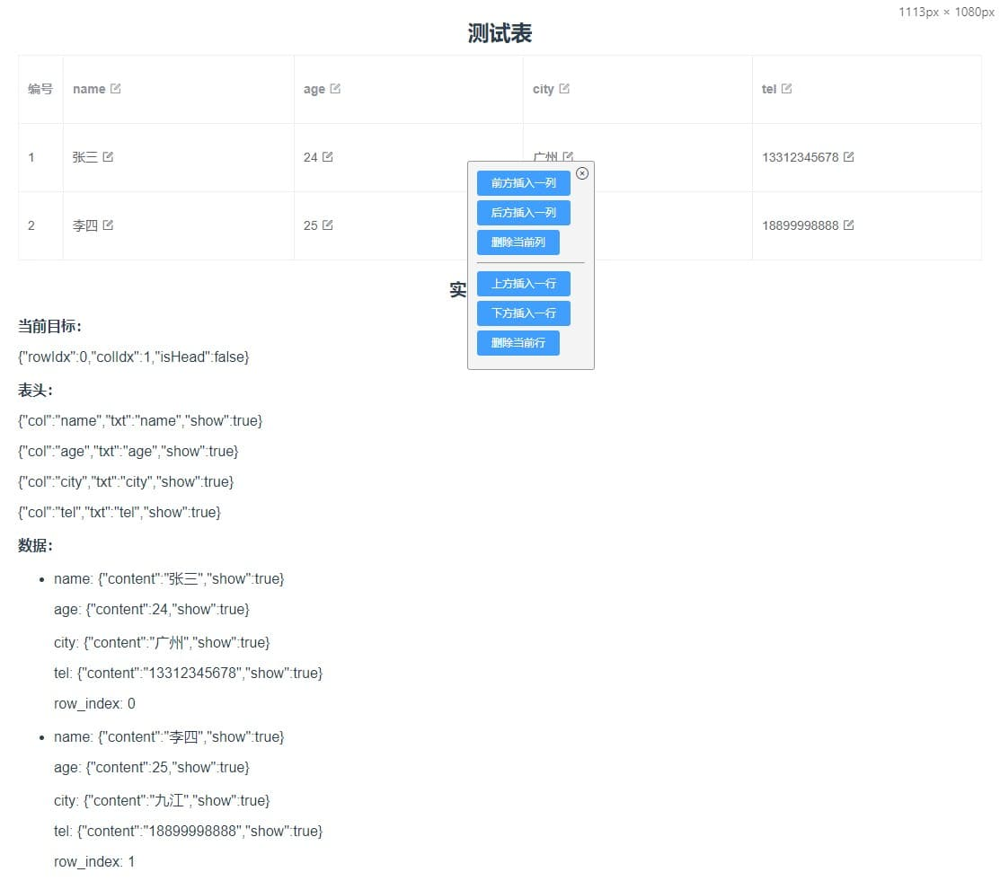
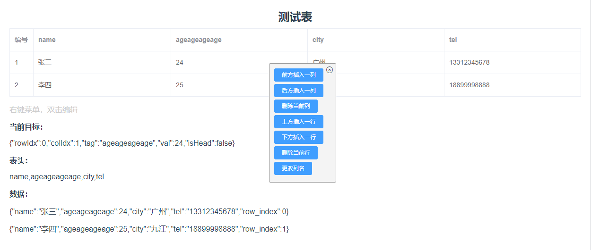
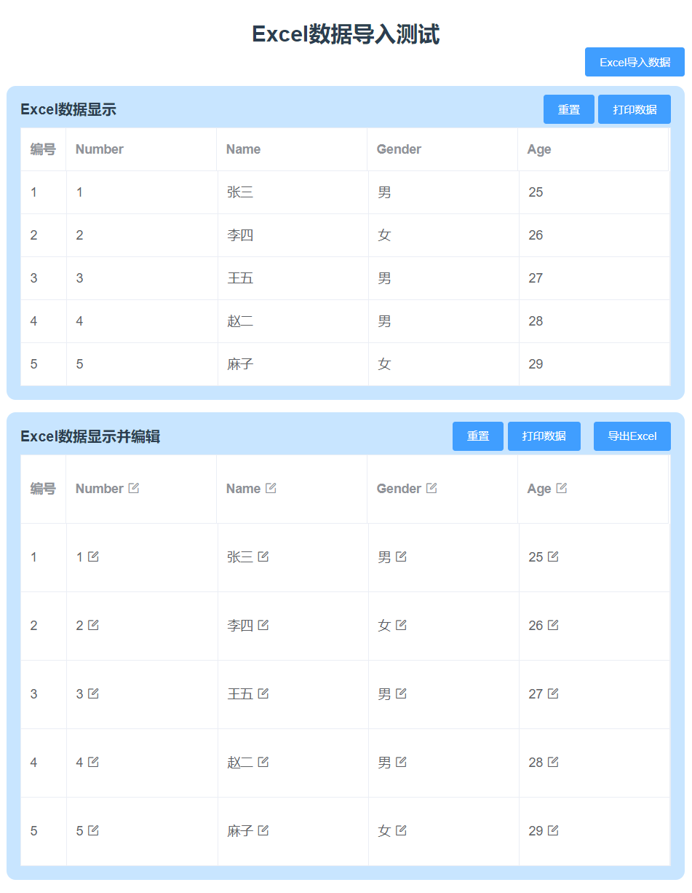

# Demos about "Editable-Table" and "Excel's Import and Export" Based on Vue3 & Element Plus

示例：可编辑表格、Excel表格导入导出

Switch to branch "vue2" to fetch the code based on Vue2 & ElementUI

主分支基于 `vue3` & `element-plus@1.1.0-beta.12`, 分支 `vue2` 基于 `vue2` & `element-ui`。

代码仅供参考，请根据实际需求进行修改和优化。

> 相关博文链接：
>
> [vue3 + Element Plus动态生成表格，并实现内容可编辑](https://blog.csdn.net/ymzhaobth/article/details/104716431)
>
> [vue导入Excel数据以及导出表格数据成Excel](https://blog.csdn.net/ymzhaobth/article/details/104714906)

## 项目目录

```text
├ .vscode
├ dist 编译输出目录
├ doc 项目文档目录
├ node_modules
├ public 静态资源
│ └ index.html 项目主页
├ src 源码目录
│ ├ assets 资源
│ ├ components 组件
│ ├ router 路由
│ ├ views 页面
│ ├ ├ Home.vue 主页导航
│ ├ ├ editable-table.vue 可编辑表格（方案一）
│ ├ ├ editable-table-v2.vue 可编辑表格（方案二）
│ ├ └ excelT.vue Excel导入/导出
│ ├ App.vue 项目根组件
│ └ main.js 项目入口
│
├ .gitignore
├ package.json
├ vue.config.js
├ README.md
└ yarn.lock
```

## 1. Editable-Table

> Editable table based on Vue3 & Element Plus
>
> Solution One:



> Solution Two:




## 2. Excel's Import and Export

> Convert excel data to table
> Generate excel file from table



## Project setup

`yarn install` or `npm install`

### Compiles and hot-reloads for development

`yarn serve` or `npm run serve`

### Compiles and minifies for production

`yarn build` or `npm run build`
