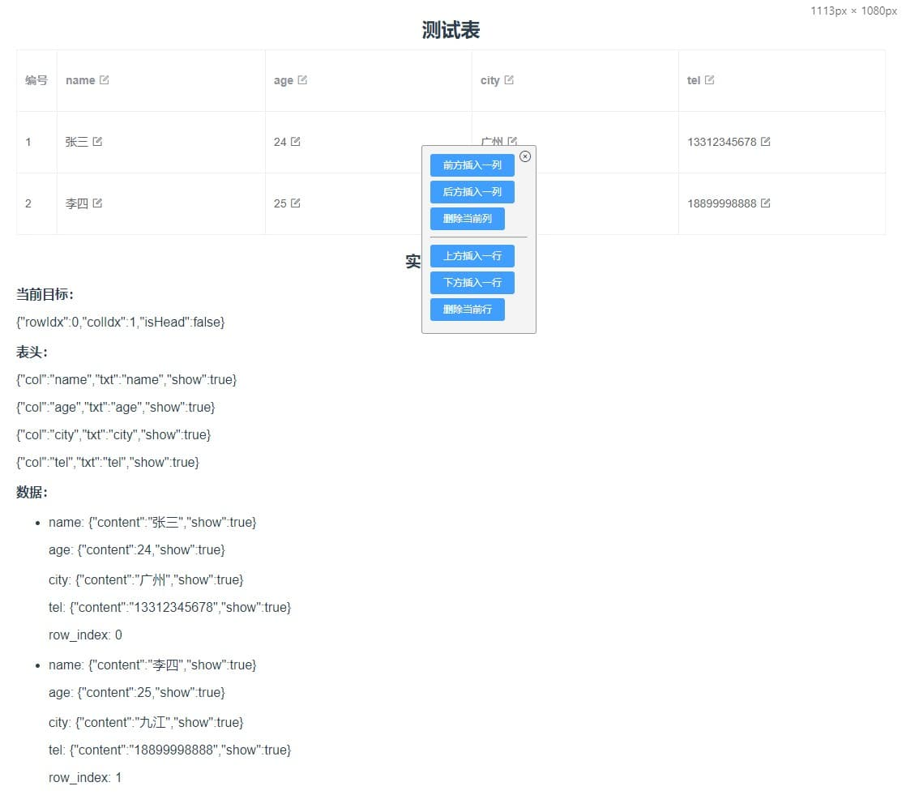
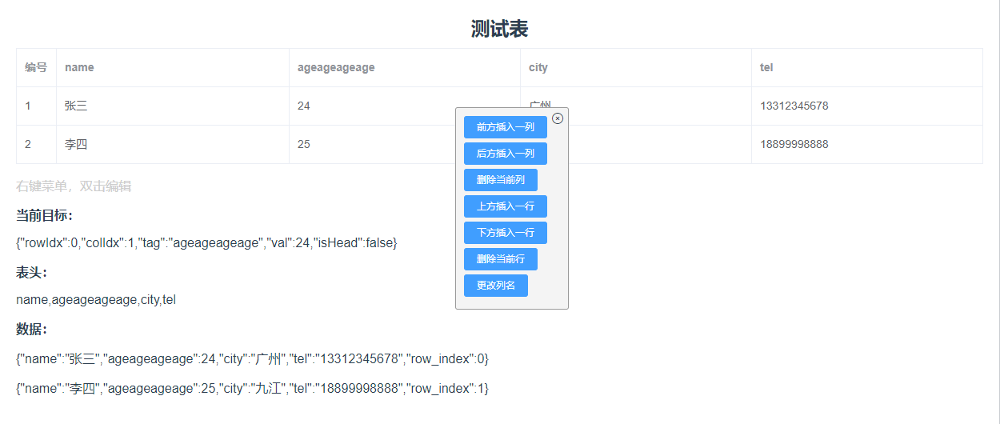
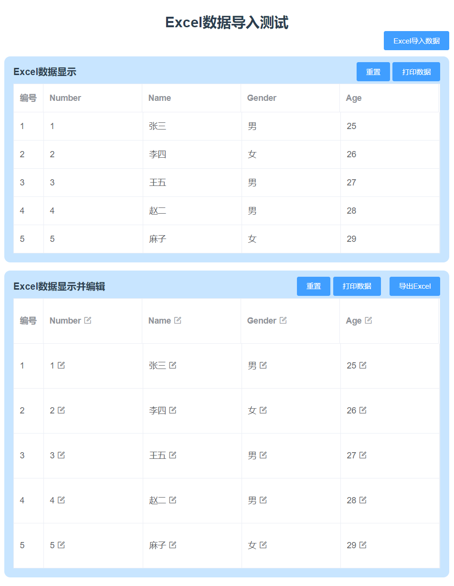

# Demos about "Editable-Table" and "Excel's Import and Export" Based on Vue3 & Element Plus

示例：可编辑表格、Excel表格导入导出

Switch to branch "vue2" to fetch the code based on Vue2 & ElementUI

## 1. Editable-Table

> Editable table based on Vue3 & Element Plus
> 
> Solution One:



> Solution Two:



## 2. Excel's Import and Export

> Convert excel data to table
> Generate excel file from table




## Project setup
```
yarn install
```
or
```
npm install
```

### Compiles and hot-reloads for development
```
yarn serve
```
or
```
npm run serve
```

### Compiles and minifies for production
```
yarn build
```
or
```
npm run build
```
