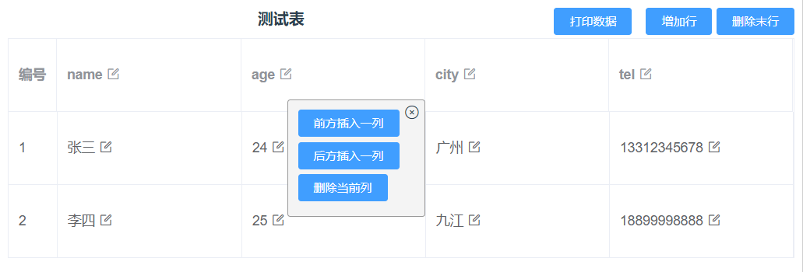

# Demos about Table and Excel

> Convert excel data to table
>
> Generate excel file from table


> Editable table based on Vue & Element Plus
> Solution One:



> Solution Two:


## Code based on Vue2 & ElementUI

switch to branch "vue2" to fetch the code

## Project setup
```
yarn install
```
or
```
npm install
```

### Compiles and hot-reloads for development
```
yarn serve
```
or
```
npm run serve
```

### Compiles and minifies for production
```
yarn build
```
or
```
npm run build
```